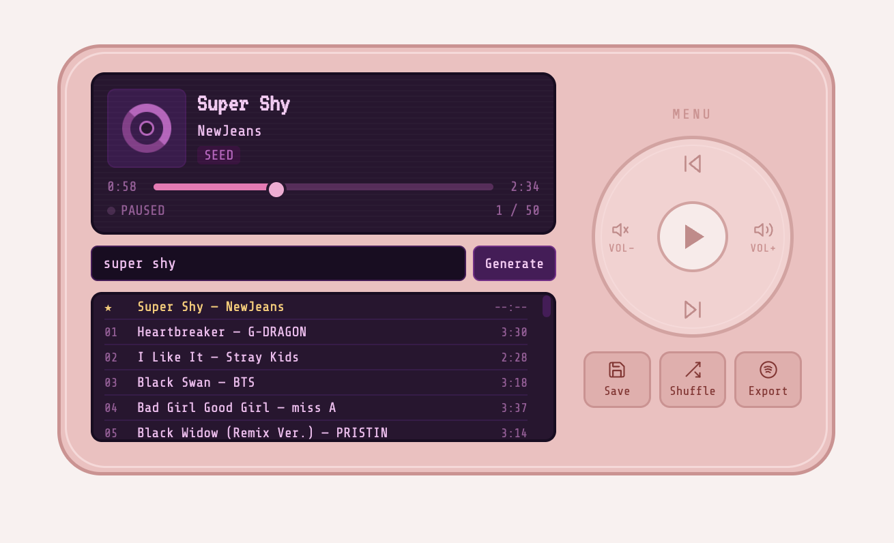
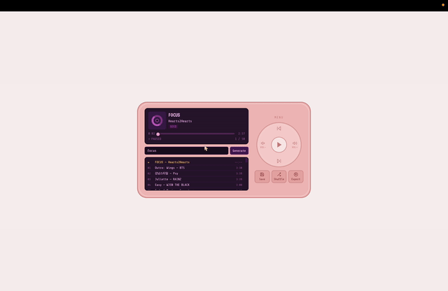
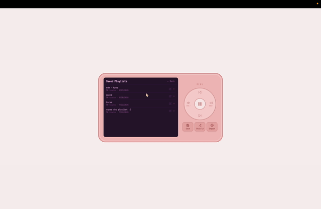

# 💗 K-Pop Retro MP3 Player

A personal K-pop recommender disguised as a retro pink iPod nano — pick a song I like, and it finds what to play next by sub-genre and audio-feature similarity, then streams it straight from Spotify.

  

> Built for my own use, not a public app — no accounts, no deployment, just a local single-user tool. Sharing here as a build log / portfolio piece.



## Demo

Type a song, hit Generate, and the queue fills in below — playback and the click wheel controls all update live.



Queues can be saved, renamed, and reloaded from the Saved Playlists panel.



## Why

Most recommenders are a black box. This one is a single HTML file I can read top to bottom, backed by a ~1,300-track library scored on real audio features (danceability, energy, valence, tempo...) — so "songs like this one" actually means something.

## Features

- 🎧 **Spotify Web Playback SDK** — full in-browser playback via my Spotify Premium account
- 🧠 **Two-tier recommendation** — audio-feature cosine similarity when available, falling back to Last.fm tag overlap, then random
- 🔍 **Auto-extending library** — searching a song that isn't in the library yet resolves it via Last.fm, tags it, and adds it on the fly
- 💾 **Saved playlists** — build, save, rename, and reload queues
- ⬆️ **Export to Spotify** — push a queue straight into a real Spotify playlist
- 🖥️ **Zero build step** — one HTML file, vanilla JS, inline SVG icons, no npm/webpack

## How it's built

```
buildlib.py          → pulls K-pop tracks + sub-genre tags from Last.fm      → songs.json
build_features.py    → enriches each track with ReccoBeats audio features    → songs.json
server.py            → local Flask server: serves the app + auto-add endpoint
kpop-mp3-player.html → UI, recommendation logic, Spotify playback & export
```

Runs entirely on `127.0.0.1` — the Flask server only exists so `fetch()` can read `songs.json` and so newly-searched songs can be appended to the library.

## Stack

Vanilla HTML/CSS/JS on the front end, a minimal Flask server for local persistence, [Last.fm](https://www.last.fm/api) for genre tagging, and [ReccoBeats](https://reccobeats.com/) for audio features — no database, no bundler, no framework.

## Status

Library currently sits at 1,267 tracks, 1,107 with full audio-feature coverage. Actively used and tweaked as a daily driver.
