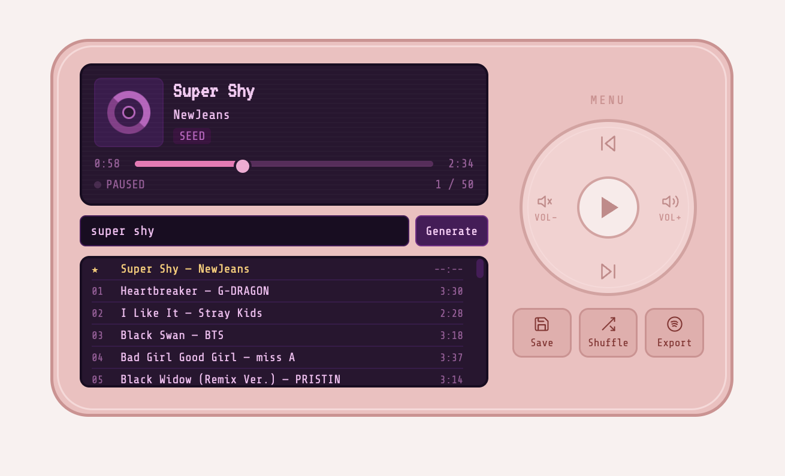

# Cold-start recommendation for long-tail K-pop

**Problem.** Build content-based recommendations with no user interaction logs
and no audio-feature API — Spotify deprecated `audio-features` in November
2024 — for a catalogue where most tracks carry no usable metadata.

**Data.** 1,267 K-pop tracks pulled from Last.fm, enriched with listener counts
(Last.fm) and acoustic features (ReccoBeats), plus 45,601 pseudo-relevance
labels derived from `track.getSimilar` and intersected with the local library.

**Result.** User-generated tags are not a viable retrieval signal in the long
tail, and the failure is architectural rather than algorithmic. After removing
the four tags that every K-pop track carries, **72.7% of the corpus has no
usable tag at all** — verified track by track against the API, so this is a
real absence of tagging, not a gap in collection. Broken out by popularity, the
gap is total:

| Popularity quintile | UGC tag coverage | Acoustic feature coverage |
|---|---:|---:|
| Q1 (coldest) | **0%** | 84% |
| Q2 | **0%** | 93% |
| Q3 | 9% | 85% |
| Q4 | 33% | 87% |
| Q5 (hottest) | 94% | 89% |

Tag coverage swings **94 percentage points** across the distribution; acoustic
coverage swings **9**. A recommender built on tags cannot reach the tail because
the input features do not exist there — no amount of ranking work changes that.


---

## Why this is the interesting question

The obvious reading of "new tracks have no tags" is that tagging lags release.
The data says otherwise, and this is the one claim worth testing rather than
asserting. Standardizing both predictors and regressing effective tag count on
them jointly, over the 1,098 tracks carrying both a listener count and a
release year inside the 1990-2026 sanity range:

| Predictor | Univariate | Partial |
|---|---:|---:|
| Release year | +0.382 | **+0.152** |
| log10(listeners) | +0.620 | **+0.557** |

Popularity barely moves when year is held constant — it keeps 90% of its
univariate association. Year loses 60% of its own once popularity is held
constant, so most of the apparent age effect was popularity in disguise. And
the residual year coefficient is *positive*: newer tracks carry slightly
**more** tags, which is the opposite of what a tagging-lag story predicts.


The right-hand panel is the tagging-lag hypothesis failing in one line: the
share of zero-tag tracks falls monotonically from 91% for pre-2010 releases to
39% for 2023-and-later. Older tracks have had fifteen years to accumulate tags
and still have none.

Tags are user-generated content, and they accumulate only where listeners
already are — which is precisely where a recommender is least needed.

One number makes the mechanism concrete. The first tagging pass traversed the
corpus in descending popularity order and was interrupted partway. The tracks
it had already reached turned out to be **9.5× more popular** (median listeners)
than the ones the backfill pass had to fill in later. The collection bug and the
research finding have the same cause.

That reframes the engineering problem. Scraping more tag sources has a low
ceiling. The effort belongs on signals that do not depend on anyone having
listened to the track first.

## Does any of this actually rank better?

Five policies, scored against the pseudo-relevance labels over 1,021 seeds.
Every policy is charged for the seeds it cannot serve, because a policy with no
signal does not rank badly — it does not rank at all, and a user feels the
difference as an empty result rather than a poor one.

| Policy | Can rank | NDCG@10 where it can | NDCG@10 over every seed |
|---|---:|---:|---:|
| `random` | 100% | 0.036 | 0.036 |
| `popularity` | 100% | 0.072 | **0.072** |
| `tags` | 33% | **0.201** | 0.067 |
| `acoustic` | 87% | 0.054 | 0.047 |
| `hybrid` (what the app ships) | 92% | 0.063 | 0.058 |

**At K=10, no content-based policy beats ranking by raw popularity.** That is
the headline, and it is a negative result. Tag overlap is by far the strongest
signal *where a tag exists* — 0.201, nearly three times the popularity baseline
— but it reaches only a third of the catalogue, and averaged over every seed
that advantage is spent.

The result is not stable across list length, which is worth stating plainly
rather than quoting the K that flatters the conclusion:

| NDCG@K, every seed | K=5 | K=10 | K=20 | K=50 |
|---|---:|---:|---:|---:|
| `popularity` | 0.062 | **0.072** | **0.071** | **0.070** |
| `tags` | **0.076** | 0.067 | 0.062 | 0.058 |
| `hybrid` | 0.062 | 0.058 | 0.056 | 0.059 |
| `acoustic` | 0.048 | 0.047 | 0.045 | 0.047 |
| `random` | 0.036 | 0.036 | 0.036 | 0.041 |

At K=5 tag overlap does beat the baseline, 0.076 against 0.062. It loses the
lead by K=10 and keeps losing it: tags concentrate their hits at the very top
of a short list, whereas popularity keeps paying off as the list grows. Which
policy "wins" therefore depends on how long a queue the product actually shows
— a 5-track list and a 50-track list have different answers.

That measurement settled a product question. The app used to hand back 50
tracks; it now hands back 20. A shorter queue is not a better ranking — it is
the same list, truncated — but the recommender's edge is concentrated at the
top and thins out with depth. Per-slot precision runs 1.72x random at 5 and
only 1.35x by 50, while the chance of hitting anything the listener likes
climbs from 24% to 76%. Twenty keeps a 56% hit rate at 1.52x random, which is
the better end of that trade.


### What the tag policy is actually doing

One number reframes that 0.201. **26.6% of the tag policy's top-10 is the seed's
own artist** — against 1.4–3.5% for every other policy. Artist names survive as
raw Last.fm tags (`bts`, `seokjin`) and pass the discriminative-tag test, so tag
matching partly degenerates into artist matching.

That matters because `track.getSimilar` is artist-deduplicated: only 2.2% of the
labels are same-artist, so those slots are scored as misses almost regardless of
what is in them. The recommender still keeps them — another song by an artist you
just played is usually a good suggestion, and removing it would be a worse
product to make a benchmark easier — so the benchmark reports both readings:

| Policy | Same-artist share of top-10 | NDCG@10 as shipped | NDCG@10 artist-blind |
|---|---:|---:|---:|
| `random` | 1.4% | 0.036 | 0.035 |
| `popularity` | 2.5% | 0.072 | 0.071 |
| `tags` | **26.6%** | 0.067 | 0.070 |
| `acoustic` | 2.5% | 0.047 | 0.045 |
| `hybrid` | 3.5% | 0.058 | 0.056 |

The aggregate effect is small — `tags` gains 0.003 when its artist is removed
from both sides. So this is a finding about *what tag overlap does*, not a
correction to the numbers above: whatever the tag policy scores, it scores while
spending a quarter of the list on recommendations these labels cannot credit.

The aggregate hides the actual structure, because it is dominated by the head
where the labels are dense. Split by popularity, the ordering inverts:

| Policy | Q1 coldest | Q2 | Q3 | Q4 | Q5 hottest |
|---|---:|---:|---:|---:|---:|
| `random` | 0.022 | 0.024 | 0.040 | 0.041 | 0.039 |
| `popularity` | 0.006 | 0.011 | 0.044 | 0.094 | 0.144 |
| `tags` | **0.000** | **0.000** | 0.017 | 0.061 | **0.196** |
| `acoustic` | 0.035 | 0.034 | 0.057 | 0.055 | 0.043 |
| `hybrid` | **0.037** | 0.036 | 0.065 | 0.060 | 0.073 |

Quintiles are cut over the whole 1,267-track library, not over the 1,021 seeds
that happen to have labels. The distinction matters more than it sounds: label
coverage runs 43% / 63% / 100% / 99% / 98% across the five, so cutting over the
labelled subset would quietly redefine Q1 as *the coldest fifth of the tracks
Last.fm could describe* — a warmer population than the one the project is about,
and one that flatters every method in the table.

Three things happen at the cold end, and they are the whole argument:

1. **The tag policy scores exactly zero in the coldest two quintiles** — not
   weak, absent. It can rank 0% of those seeds, because none of them has a
   discriminative tag.
2. **Ranking by popularity falls below random** in Q1 (0.006 against 0.022) and
   again in Q2 (0.011 against 0.024). For an obscure seed the relevant tracks
   are themselves obscure, so a global popularity ordering is actively worse
   than chance. The floor here is averaged over 20 draws rather than sampled
   once: a single draw of Q1's 110 evaluable seeds swings by ±0.013, which is
   wider than the gap being claimed.
3. **Only the acoustic and hybrid policies stay above the floor across the whole
   distribution.** They can rank 80–94% of seeds in every quintile, because
   audio features do not depend on anyone having listened to the track first.

So the honest summary is not "content beats popularity" — it does not. It is
that popularity and tags win a benchmark whose labels are 2.4× more popular
than the corpus, and both fail exactly where a recommender has to earn its
keep. The acoustic signal is the only one still standing in the tail, and it is
weak there in absolute terms.

## Judging the cold end

Everything above is scored against CF labels that reach 43% of the coldest
quintile, so the cold-end column is computed on the warmest part of the cold
end. That is not a metric problem and no metric fixes it — the labels are
absent. The only remedy is to look at those tracks by hand, and `make pool`
builds the task for doing so:

```bash
make pool        # bundled sample
make pool-full   # 40 seeds drawn from Q1 and Q2 of the full library
```

Two decisions make the result usable as evidence rather than as a second
opinion about the baseline.

**The pool is the union of every policy's top 10, not one policy's.** Judge a
single ranking and its rivals are scored on candidates nobody assessed, so the
policy the pool came from wins by construction. Pooling across all five means
each policy's own top 10 is fully judged. Below that depth the judgements
genuinely run out, and `evaluate_ranking(judged=...)` condenses those positions
away rather than scoring an unexamined track as a miss — counting silence as
irrelevance is what turns incomplete judgements into a biased benchmark.

**The annotator is shown title and artist only.** No listener counts, no tags,
no policy attribution, and the candidates arrive shuffled. Popularity is the
baseline under test; someone who can tell which candidate is the famous one is
no longer independent evidence about whether cold-start ranking works. The
provenance lives in a separate key file that is read only when scoring.

Seeds are sampled uniformly from the requested quintiles — including seeds no
content policy can rank and seeds the CF labels never reached. Both belong in
the sample: how often the cold end cannot be served at all is one of the things
being measured.

**The judgements have not been collected.** What exists is the task, the
sampling, and the scoring path.

## What is actually established

Honest scope: this repository contains the data foundation, the exploratory
analysis, a diagnosed offline benchmark, and ranking results measured against
it. The recommendation logic evaluated here is the heuristic the app ships
(feature-distance nearest neighbour, tag overlap as fallback), lifted into
`src/kpoprec/recommend.py` so the benchmark and the app cannot drift apart. No
learned model is trained.

| Claim | Status |
|---|---|
| 72.7% of tracks have zero effective tags | Measured, per-track API verified |
| Tag coverage is popularity-dependent (94pp spread) | Measured |
| Acoustic coverage is popularity-independent (9pp spread) | Measured |
| 8.4% of tracks are unreachable by any content signal | Measured |
| Sparsity is driven by obscurity, not novelty | Measured — partial coefficients +0.56 popularity vs +0.15 year |
| Content method beats a popularity baseline | Measured — no at K=10; tag overlap edges ahead at K=5 |
| Tags are the strongest signal where they exist | Measured — 0.201, 2.8x the baseline |
| Cold-tail behaviour under human judgement | **Not established** — pooled task built, unjudged |
| Only acoustic signal stays above the random floor in the cold tail | Measured |

## Recomputed in SQL

Every number in this README and in `reports/` comes out of pandas and numpy.
`make sqlcheck-full` computes all of them a second way — in SQLite, from the
raw library and labels — and fails if any of them disagrees with what was
printed. `make sqlcheck` does the same for the bundled sample, with no
credentials.

- `sql/schema.sql` holds the library, its labels and the benchmark's rankings
  as normalized tables — losslessly: a test rebuilds `songs.json` from them —
  and defines each derived quantity once, in SQL: effective tags, popularity
  quintiles, which policy can serve which seed, and per-seed
  Recall/Precision/HitRate/NDCG@K.
- `sql/checks/` has one query per published result: medians and percentiles
  written with window functions, the novelty-vs-obscurity regression solved in
  closed form from three correlations, NDCG from the stored rankings joined
  against the labels.
- The rankings themselves still come from `recommend.score`. Whether a seed is
  evaluable, whether a policy can serve it, and every metric are SQL's own.

**197 numbers are checked on the full corpus, and all of them match** — the
benchmark CSVs to 1e-16, everything else to the last printed digit. Getting
there turned up four problems in the pandas side, all fixed in the same change:

| Found | Fix |
|---|---|
| `gt_diagnostics.md` predated the last listener-count refresh (library median 92,948 against 93,286 now) | regenerated |
| Three definitions of "popularity quintile": `quintile_of` in the benchmark, `pd.qcut` in the sparsity figures, equal chunks of unique join keys in the label diagnostics. The diagnostics reported 64% / 100% / 100% label coverage for Q2 / Q4 / Q5 where the benchmark's own strata give 63% / 99% / 98% | all three use `quintile_of`; the SQL view reproduces it exactly, which `NTILE(5)` does not — it moves one track |
| Two numbers typed into the benchmark report's prose (Q2's 64%, the 2.2% same-artist share), so the sample report printed the full corpus's figures | computed from the data |
| `tag_vocabulary.csv` reordered its ties on every run, because set iteration follows the hash seed | ties broken by name |

None of them moves a headline result. The point of the check is the next
change to the data: a stale report or a drifted definition now fails a `make`
target instead of reaching the README.

## Limitations

These are load-bearing, not boilerplate.

1. **The relevance labels come from collaborative filtering.** Last.fm's
   `track.getSimilar` is CF output, not observed user preference. Anything
   scored against these labels measures *how closely a content-based method
   reproduces an industrial CF system* — a real question, but not "does the
   user like it".
2. **The coldest quintile cannot be evaluated offline.** Only 43% of Q1 seeds
   get any in-library positive at all, against ~100% for Q3–Q5. The seeds it
   misses are not scored badly — they do not appear in the tables at all, so
   the cold end is measured on the most popular 43% of itself. The part of the
   catalogue this project is about is exactly the part the benchmark cannot
   score. Closing that needs human relevance judgements, not more CF labels:
   `make pool` builds the task (see *Judging the cold end*), and the judgements
   themselves are not yet collected.
3. **Positives skew 2.4× more popular than the corpus median**, so a pure
   popularity baseline will be strong and must be reported alongside any
   content-based method.
4. **The novelty-vs-obscurity regression covers 87% of the corpus, and the
   missing 13% is not random.** MusicBrainz resolves a release year for 1,099
   of 1,267 tracks, but its own coverage is popularity-dependent: 68% in the
   coldest quintile against 93% in the hottest, and unresolved tracks have
   one-eighth the median listeners of resolved ones. The regression therefore
   under-weights exactly the tail this project is about. The result is stable
   across the full corpus and the 200-track sample, but a stronger test needs a
   year source that does not thin out in the tail.
5. **Corpus size is ~1.3k tracks**, which bounds both label density and
   candidate-pool realism. Brute-force similarity is entirely adequate at this
   scale; an ANN index would be premature.
6. **The acoustic policy's feature weights were never tuned.** They are the
   hand-set perceptual weights the app shipped with — mood and energy at 1.0,
   production traits lower. So "acoustic ranking is weak in absolute terms" is
   a statement about *this* weighting, not about acoustic features as such.
   Learning the weights against the labels is the obvious next experiment, and
   is not done here.

Full diagnostics: [`reports/gt_diagnostics.md`](reports/gt_diagnostics.md) ·
[`reports/tag_sparsity_summary.md`](reports/tag_sparsity_summary.md)

## Quickstart

```bash
git clone https://github.com/snuuym/kpop-rec.git
cd kpop-rec
make install
make test      # 128 tests, no network or credentials needed
make eval      # runs the full analysis on the bundled sample
make bench     # ranks the sample and scores it against the sample labels
make sqlcheck  # recomputes every number in the sample reports in SQLite
```

`make eval` runs against `data/songs.sample.json` (200 tracks, stratified across
popularity quintiles), needs no API key, and writes to `reports/sample/` so it
never overwrites the committed full-corpus results. The sample reproduces the
headline finding closely — 74.0% zero-tag against 72.7% on the full corpus, a
98-point coverage spread against 94, and the same central regression result
(partial coefficients +0.54 popularity / +0.15 year, against +0.56 / +0.15 on
the full corpus).

`make bench` scores five ranking policies against `ground_truth.sample.json`
and writes `reports/sample/eval_summary.md`. Its absolute numbers sit higher
than the committed ones because the candidate pool is 200 tracks rather than
1,267 — what carries over is the ordering of the policies and the shape of the
per-quintile curve.

To rebuild the full dataset:

```bash
cp .env.example .env    # fill in LASTFM_API_KEY
set -a && source .env && set +a
make all                # ~40 minutes, rate-limited, resumable
```

Every stage caches incrementally, so an interrupted run resumes where it
stopped rather than starting over.

## Pipeline

| Stage | Script | Produces |
|---|---|---|
| 1 | `build_library.py` | tracks + sub-genre labels from Last.fm |
| 2 | `backfill_tags.py` | tags the first pass missed, marked `tag_source` |
| 3 | `enrich_metadata.py` | listeners / playcount (Last.fm), year (MusicBrainz) |
| 4 | `build_features.py` | acoustic features via Spotify ID → ReccoBeats |
| — | `check_gt_density.py` | feasibility probe: is there enough ground truth? |
| 5 | `build_ground_truth.py` | pseudo-relevance labels + bias diagnostics |
| 6 | `analyze_tag_sparsity.py` | the EDA and figures 1-5 |
| 7 | `evaluate.py` | the ranking benchmark and figure 6 |
| — | `build_db.py`, `sql_crosscheck.py` | the SQLite database; every published number recomputed in SQL |

Stage 2 exists because of stage 1's failure mode, and stage 5's diagnostics
exist because pseudo ground truth is easy to build and easy to over-trust. The
feasibility probe runs *before* the full ground-truth build so the benchmark
isn't committed to before its density is known.

## Layout

```
app/          single-file web UI + local Flask server
src/kpoprec/  shared library: taxonomy, normalization, Last.fm client, safe I/O,
              ranking policies (recommend.py) and metrics (metrics.py)
scripts/      the six pipeline stages, each a thin CLI
data/         sample dataset (full library is gitignored — see data/README.md)
sql/          SQLite schema and views, and one query per published number
reports/      generated analysis, committed so results are reviewable
figures/      generated charts
tests/        128 tests over taxonomy, joins, I/O, ranking policies, metrics
              and the SQL layer
```

Two design notes worth the words:

- **The taxonomy lives in one module.** Two pipeline stages classify tracks, and
  if they disagree the sparsity analysis is comparing two different label
  spaces. `src/kpoprec/taxonomy.py` is the single source of truth, and a test
  asserts no style rule keys on a root tag.
- **Normalization is a correctness concern, not a formatting one.** Ground truth
  is built by intersecting Last.fm's similar-track list against the local
  library. A weak join deflates the positive count, which is indistinguishable
  from "the labels are sparse" — so the join is centralised and tested.

## The app

A single HTML file with no build step: pick a seed track, get a 20-track queue,
play it through the Spotify Web Playback SDK, export it to a real playlist.



Search and generate:


Saved playlists:


```bash
make app     # http://127.0.0.1:5000
```

The server exists for three reasons: `fetch()` cannot read the library from
`file://`; credentials are read from the environment and served to the page at
`/config.json` rather than baked into the HTML; and searching an off-library
track appends it through a single validated, deduplicated, atomically written
endpoint.

Playback needs a Spotify Premium account and a client ID registered with
`http://127.0.0.1:5000/kpop-mp3-player.html` as a redirect URI. Everything
except playback and export works without it.

## Stack

Python (requests, pandas, numpy, matplotlib, Flask) · vanilla JS front end, no
framework or bundler · [Last.fm](https://www.last.fm/api) for tags and
popularity · [ReccoBeats](https://reccobeats.com/) for acoustic features ·
[MusicBrainz](https://musicbrainz.org/) for release years · SQLite
(standard-library `sqlite3`) as a derived store for cross-checking the results;
the pipeline itself reads and writes JSON.

## License

MIT — see [LICENSE](LICENSE). The code is MIT; the underlying track metadata
belongs to Last.fm and its contributors, which is why this repository ships a
sample rather than the full extracted dataset.
