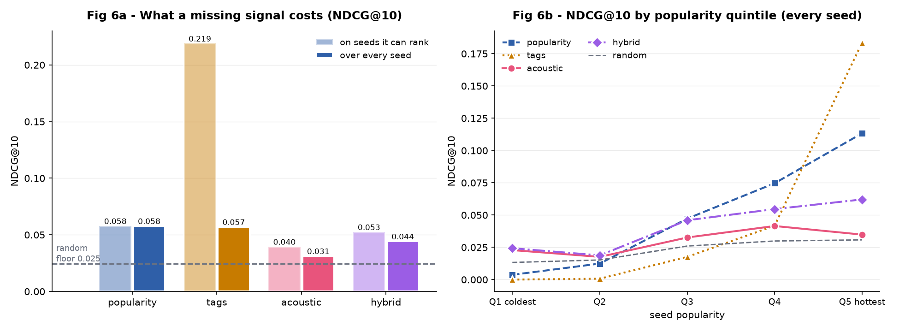

# Ranking evaluation

> Scored against pseudo-relevance labels from Last.fm `track.getSimilar`.
> **These are collaborative-filtering output, not observed user preference.**
> A high score means a content-based ranking reproduces an industrial CF
> system, which is a real question but not "does the listener like it".

## Protocol

- Seeds evaluated: **1587** (every seed with at least one in-library positive)
- Candidate pool: the whole library, 1892 tracks, minus the seed itself
- Positives per seed: median **49**
- Reported at K = 10; the full K sweep is in `eval_by_k.csv`
- Random Precision@10 floor: **0.025**
- Deterministic: fixed RNG seed, stable tie-breaking by library index

The app's random jitter and per-tag diversity cap are excluded. Both act
after the ranking is chosen and would only add noise to the measurement.

## Headline

| Policy | Can rank | NDCG@10 served | NDCG@10 all seeds | Recall@10 all | HitRate@10 all |
|---|---:|---:|---:|---:|---:|
| `random` | 100% | 0.025 | **0.025** | 0.005 | 0.217 |
| `popularity` | 100% | 0.058 | **0.058** | 0.011 | 0.359 |
| `tags` | 26% | 0.219 | **0.057** | 0.012 | 0.207 |
| `acoustic` | 79% | 0.040 | **0.031** | 0.007 | 0.247 |
| `hybrid` | 84% | 0.053 | **0.044** | 0.009 | 0.286 |

**The two NDCG columns are the point.** *Served* averages only over seeds
the policy has any signal for; *all seeds* charges it zero where it has none.
A policy that is accurate but blind scores well on the first and badly on the
second, and the second is what a user experiences.

## Same-artist recommendations

The shipped recommender does **not** drop tracks by the seed's own artist:
another song by an artist you just played is usually a good suggestion, and
removing it would be a worse product to make a benchmark easier. But Last.fm's
`track.getSimilar` is artist-deduplicated -- only 2.5% of the labels are
same-artist -- so those slots are almost always scored as misses whatever they
actually contain. The artist-blind column drops the seed's artist from the
ranking and the labels together, which is the only way to compare policies on
ground the labels can actually judge.

| Policy | Same-artist share of top-10 | NDCG@10 as shipped | NDCG@10 artist-blind |
|---|---:|---:|---:|
| `random` | 1.1% | 0.025 | 0.024 |
| `popularity` | 1.6% | 0.058 | 0.059 |
| `tags` | 21.3% | 0.057 | 0.060 |
| `acoustic` | 2.2% | 0.031 | 0.031 |
| `hybrid` | 3.1% | 0.044 | 0.044 |

`tags` is the only policy materially affected: **21%** of its
top-10 is the seed's own artist, against 1-4% for everything else. Artist
names survive as raw Last.fm tags and pass the discriminative-tag test, so tag
matching partly degenerates into artist matching. That is worth knowing before
reading its headline number: whatever the tag policy scores, it scores while
spending a quarter of the list on recommendations these labels cannot credit.

## By popularity quintile

Every seed counted, blind spots charged zero.

| Policy | Q1 coldest | Q2 | Q3 | Q4 | Q5 hottest |
|---|---|---|---|---|---|
| `random` | 0.013 | 0.015 | 0.026 | 0.030 | 0.031 |
| `popularity` | 0.004 | 0.012 | 0.047 | 0.075 | 0.113 |
| `tags` | 0.000 | 0.001 | 0.018 | 0.042 | 0.183 |
| `acoustic` | 0.023 | 0.018 | 0.033 | 0.042 | 0.035 |
| `hybrid` | 0.024 | 0.019 | 0.046 | 0.055 | 0.062 |

Share of seeds each policy can rank at all:

| Policy | Q1 coldest | Q2 | Q3 | Q4 | Q5 hottest |
|---|---|---|---|---|---|
| `random` | 100% | 100% | 100% | 100% | 100% |
| `popularity` | 100% | 100% | 100% | 100% | 100% |
| `tags` | 0% | 0% | 8% | 21% | 82% |
| `acoustic` | 65% | 72% | 79% | 84% | 87% |
| `hybrid` | 65% | 72% | 84% | 91% | 97% |

## By source of the seed

NDCG@10, every seed counted, blind spots charged zero. The candidate pool is the whole library in both columns; only the seed differs.

| Policy | lastfm_tag (n=1021) | spotify_playlist (n=566) |
|---|---|---|
| `random` | 0.027 | 0.020 |
| `popularity` | 0.061 | 0.052 |
| `tags` | 0.072 | 0.031 |
| `acoustic` | 0.038 | 0.020 |
| `hybrid` | 0.051 | 0.033 |

Share of seeds each policy can rank at all:

| Policy | lastfm_tag (n=1021) | spotify_playlist (n=566) |
|---|---|---|
| `random` | 100% | 100% |
| `popularity` | 100% | 100% |
| `tags` | 33% | 13% |
| `acoustic` | 87% | 65% |
| `hybrid` | 92% | 70% |

> Quintiles are cut over the whole library, so Q1 is the coldest fifth of
> the catalogue rather than the coldest fifth of the tracks that have labels.
> The two differ: ground truth reaches 47% of Q1 and 76% of Q2, and the
> seeds it misses never appear in the table above at all. So the cold end is
> not merely measured with few labels -- it is measured on the most popular
> part of itself. Read it as indicative, not decisive. That limit belongs to
> the CF labels, not to the policies being compared, and the only way past it
> is human judgement sampled where the labels are missing: `make pool`.

