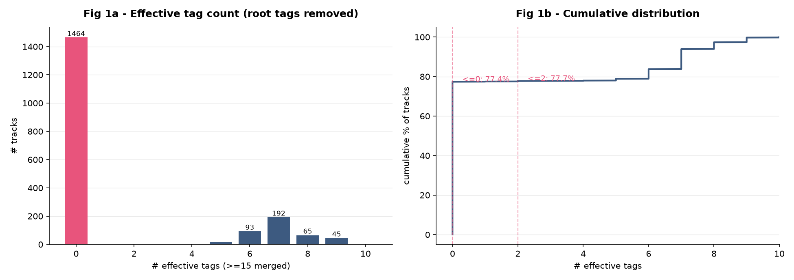
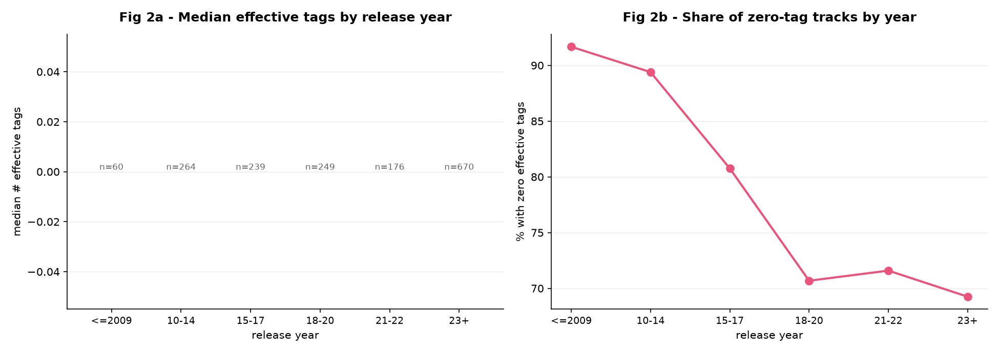
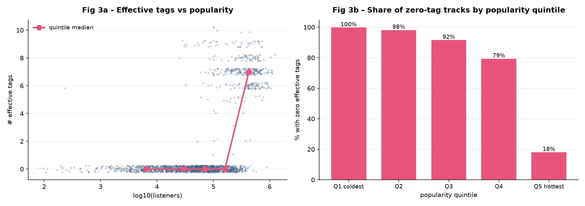
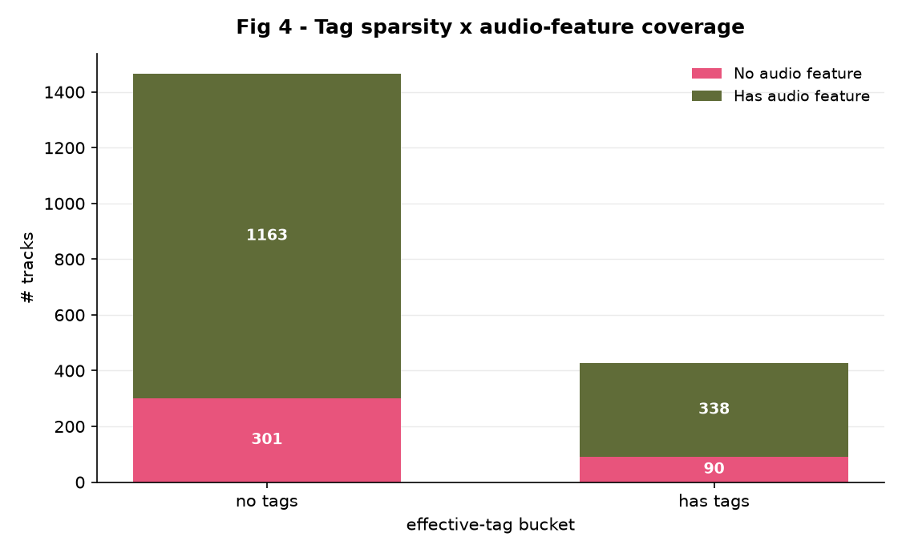
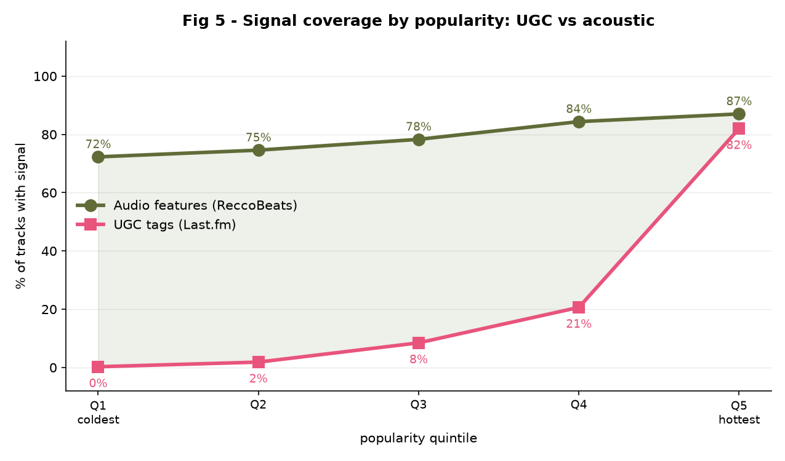

# Tag sparsity analysis

> Generated from `songs.json` · 1892 tracks

---

## Data integrity

| Status | Tracks | Share | Meaning |
|---|---:|---:|---|
| Verified: nobody has tagged it | 1461 | 77.2% | **genuine absence of UGC** (confirmed per track via the API) |
| Unverified empty `all_tags` | 0 | 0.0% | possibly a collection gap |
| Tagged, but only with root tags | 3 | 0.2% | **genuine UGC sparsity** |
| Has effective tags | 428 | 22.6% | usable |

> Empty tags were confirmed track by track against the Last.fm API: **this is genuine absence of UGC, not a gap in collection.**

## Q1 - How much signal survives removing root tags?

- Corpus size: **1892** tracks
- Raw tags average 2.2 per track; **effective tags average only 1.6** (median 0)
- **1464 tracks (77.4%) have no effective tags at all** -> tag-based retrieval cannot reach them
- 1471 tracks (77.7%) have 2 or fewer -> tag-overlap scoring barely discriminates between them
- Carrying a classified sub-genre label: 1892 (100.0%)

### Tag vocabulary

- Unique tags: **1013**
- Tags appearing on exactly one track: **672** (66.3%) -> these contribute almost nothing to similarity, and are where TF-IDF weighting would gain over plain rule matching

| Tag | Tracks | Share | Root tag |
|---|---:|---:|:---:|
| `k-pop` | 388 | 20.5% | yes |
| `kpop` | 334 | 17.7% | yes |
| `korean` | 267 | 14.1% | yes |
| `pop` | 165 | 8.7% | yes |
| `bts` | 84 | 4.4% |  |
| `dance-pop` | 77 | 4.1% |  |
| `dance` | 73 | 3.9% |  |
| `electropop` | 66 | 3.5% |  |
| `julia mofada` | 64 | 3.4% |  |
| `rnb` | 51 | 2.7% |  |
| `soty` | 49 | 2.6% |  |
| `hip-hop` | 43 | 2.3% |  |
| `rap` | 41 | 2.2% |  |
| `electronic` | 40 | 2.1% |  |
| `trap` | 36 | 1.9% |  |
| `hip hop` | 34 | 1.8% |  |
| `pop rap` | 31 | 1.6% |  |
| `contemporary rnb` | 29 | 1.5% |  |
| `edm` | 27 | 1.4% |  |
| `fire` | 26 | 1.4% |  |
| `2023` | 25 | 1.3% |  |
| `synthpop` | 25 | 1.3% |  |
| `house` | 23 | 1.2% |  |
| `amor a primeira ouvida` | 22 | 1.2% |  |
| `girl group` | 22 | 1.2% |  |

### Selection-bias check

The first tagging pass traversed the corpus in descending popularity order, so an interruption leaves a sample skewed toward the head:

| Group | Tracks | Median listeners |
|---|---:|---:|
| Tagged in the first pass | 315 | 449,255 |
| Filled in by backfill | 952 | 47,530 |

First-pass tracks are about **9.5x** as popular. **The bias is confirmed** — drawing conclusions from the first-pass sample alone would have badly overstated tag coverage. It is also independent evidence for the popularity-driven tagging hypothesis.

---

## Q2a - Tag sparsity vs release year

Sample: 1658 tracks with a known year.

## Q2b - Tag sparsity vs popularity

Sample: 1891 tracks with a listener count.

## Q2c - Is it novelty, or is it obscurity? (the central test)

Sample: 1657 tracks with both fields. All variables standardized, then regressed jointly:

| Predictor | Univariate correlation | Partial coefficient |
|---|---:|---:|
| Release year | +0.194 | **+0.087** |
| log10(listeners) | +0.572 | **+0.555** |

Model R^2 = 0.334

**Conclusion:** **Popularity dominates.** Once popularity is controlled for, the partial effect of release year collapses. "New tracks have no tags" is a surface reading of "obscure tracks have no tags" — tags are user-generated content, and they only accumulate where listeners do.

> This determines where further effort is worth spending. If sparsity is driven by popularity, scraping additional tag sources has a low ceiling, and the effort belongs on signals that do not depend on UGC at all — acoustic features, or features derived from the audio directly.

---

## Q3 - Does the fallback path hold up?

| Effective-tag bucket | No feature | Has feature | Total | Feature coverage |
|---|---:|---:|---:|---:|
| no tags | 301 | 1163 | 1464 | 79.4% |
| has tags | 90 | 338 | 428 | 79.0% |

- **Unreachable tracks: 301 (15.9%)** — no effective tags *and* no audio features. No content-based method can retrieve these; only a popularity fallback reaches them at all.
- Overall audio-feature coverage: 79.3%

> This table defines both the stratification used for evaluation and the retrieval cascade: features -> hybrid scoring, tags only -> TF-IDF, neither -> popularity.

## Central result - how each signal depends on popularity

| Quintile | UGC tag coverage | Audio-feature coverage |
|---|---:|---:|
| Q1 coldest | 0% | 72% |
| Q2 | 2% | 75% |
| Q3 | 8% | 78% |
| Q4 | 21% | 84% |
| Q5 hottest | 82% | 87% |

- UGC tag coverage varies by **82 percentage points** across quintiles — heavily popularity-dependent
- Acoustic feature coverage varies by only **15 points** — effectively popularity-independent

> **This is the argument.** UGC signal serves the head; acoustic signal covers the whole distribution. A recommender built only on the former cannot reach the long tail — not because its ranking is weak, but because the input features do not exist there. That is an architectural limit, not an algorithmic one.

## Q4 - Do the two ways of sampling agree?

The library is two samples: tracks from Last.fm's K-pop tag pages (`lastfm_tag`) and tracks from the owner's own Spotify playlists (`spotify_playlist`). Every table above pools them.

| Source | Tracks | No effective tag | Audio features | Listener count known | Median listeners | Year resolved | Median year |
|---|---:|---:|---:|---:|---:|---:|---:|
| lastfm_tag | 1267 | 72.7% | 87.4% | 100.0% | 94,136 | 86.8% | 2018 |
| spotify_playlist | 625 | 86.9% | 63.0% | 99.8% | 54,236 | 89.4% | 2024 |

The central table again, by source: how much of each popularity quintile each signal reaches. Quintiles are the whole library's, so a cell says how that source's tracks fare *within the same strata*.

| Quintile | lastfm_tag: tracks | lastfm_tag: tag coverage | lastfm_tag: audio coverage | spotify_playlist: tracks | spotify_playlist: tag coverage | spotify_playlist: audio coverage |
|---|---:|---:|---:|---:|---:|---:|
| Q1 coldest | 290 | 0% | 85% | 89 | 0% | 31% |
| Q2 | 193 | 0% | 94% | 185 | 4% | 55% |
| Q3 | 180 | 6% | 86% | 198 | 11% | 71% |
| Q4 | 261 | 20% | 87% | 117 | 23% | 79% |
| Q5 hottest | 343 | 83% | 87% | 35 | 77% | 86% |

The novelty-vs-obscurity regression, pooled and within each source:

| Sample | Tracks | Year (partial) | log10(listeners) (partial) | R^2 |
|---|---:|---:|---:|---:|
| all | 1657 | +0.087 | +0.555 | 0.334 |
| lastfm_tag | 1099 | +0.152 | +0.556 | 0.402 |
| spotify_playlist | 558 | +0.141 | +0.396 | 0.171 |
